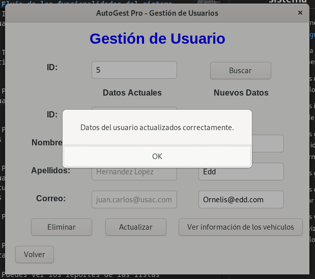
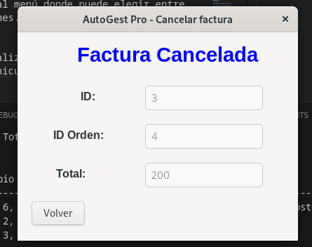
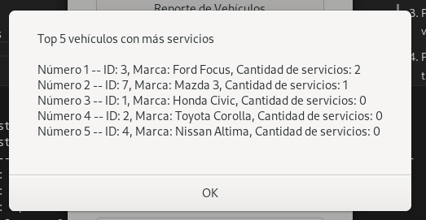

# Manual de Usuario

## Objetivos del sistema

### General
Proporcionar una guía a los usuarios interesado en utilizar el sistema integral de gestión AutoGest Pro describiendo sus características y principales funcionalidades.

### Específicos
- Describir de manera detallada las principales funcionalidades del programa para facilitar su manejo para los usuarios.

- Ofrecer un resumen de las principales características del programa, con el propósito de brindar una compresión precisa de sus capacidades.

## Introducción
El propósito de este manual es de ofrecer una guía a los usuarios para el uso adecuado del sistema integral de gestión AutoGest Pro. De esta manera facilitar la manipulación de las funcionalidades las principales funcionalidades del programa y mejorar su eficiencia de uso.

El software fue diseñado para simplificar y optimizar las tareas de gestión para un taller de vehiculos. Permite realizar cargas masivas, de usuarios, vehiculos y repuestos asi como ingresarlos de manera manual. Puede gestionar los usuarios ingresados, eliminarlos, actualizarlos y ver sus vehiculos. Tambien se puede generar servicios y cancelar facturas. Por ultimo se pueden visualizar reportes de los datos actuales en el programa.

## Información del sistema

AutoGest pro es un programa de con interfaz grafica diseñado con el lenguaje de programación C#.

Para la interfaz gráfica se utilizo la libreria para interfaces en linux GTK.

Para almacenar los datos en memoria se utilizaron estructuras de datos abstractas. Se utilizo la lista simple para almacenar los usuarios, la lista doblemente enlazada para los vehículos, la lista circular para los repuestos, la cola para los servicios, la pila para las facturas y la matriz dispersa se utilizó para crear una bitacora con los datos del id de autos, el id de los vehiculos y el detalle del servicio que se le aplicaria al vehículo.

## Especificación técnica

### Requisitos de hardware

- Procesador de al menos 2 GHz de velocidad.

- Memoria RAM de al menos 2 GB.

- Espacio de almacenamiento disponible de al menos 500 MB.

### Requisitos de software

- Sistema operativo compatible: Una distribución de Linux compatible.

- .NET SDK 6.0 o superior.

- GTK 4 y sus dependencias instaladas.

- Compilador de C# como dotnet o mono.

- Editor de código como Visual Studio Code o JetBrains Rider.

## Flujo de las funcionalidades del sistema

1. Inicialmente debe iniciar sesion como el usuario root@gmail.com.

2. Te lleva al menú donde puede elegir entre varias opciones.

3. Puedes realizar la carga masiva de usuarios, vehiculos y repuestos.

4. Puedes ingresar los datos manualmente de los tres tipos de datos que se manejan.

5. Puedes gestionar los usuarios buscando un usuario por su id. Puede eliminarlo, actualizar sus datos o ver la información de sus vehiculos.

6. Puedes generar un servicio.

7. Puedes cancelar la factura generada a la hora de generar un servicio.

8. Puedes ver los reportes de las listas generados por graphviz o ver el top por servicios o modelo de los vehiculos.

