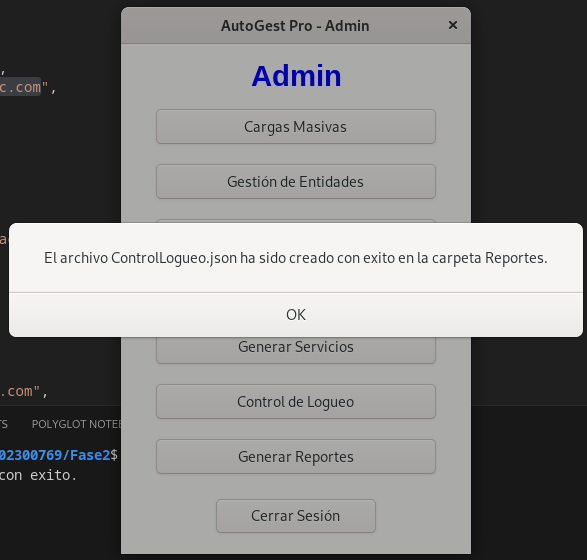

# Manual de Usuario

## Objetivos del sistema

### General
Proporcionar una guía a los usuarios interesado en utilizar el sistema integral de gestión AutoGest Pro describiendo sus características y principales funcionalidades.

### Específicos
- Describir de manera detallada las principales funcionalidades del programa para facilitar su manejo para los usuarios.

- Ofrecer un resumen de las principales características del programa, con el propósito de brindar una compresión precisa de sus capacidades.

## Introducción
El propósito de este manual es de ofrecer una guía a los usuarios para el uso adecuado del sistema integral de gestión AutoGest Pro. De esta manera facilitar la manipulación de las funcionalidades las principales funcionalidades del programa y mejorar su eficiencia de uso.

El software fue diseñado para simplificar y optimizar las tareas de gestión para un taller de vehiculos. Siendo administrador se permite realizar cargas masivas, de usuarios, vehiculos y repuestos asi como administrar los dos primeros. Puede actualizar los repuestos, ver los repuesto en distinto recorridos como tambien puede generar servicios, generar reporte del login y reportes graficos de las estructuras. Como usuario de la aplicación puedes insertar vehiculos, ver tus servicios en diferentes recoridos y facturas pendientes. Las facturas puedes cancelarlas.

## Información del sistema

AutoGest pro es un programa de con interfaz grafica diseñado con el lenguaje de programación C#.

Para la interfaz gráfica se utilizo la libreria para interfaces en linux GTK.

Para almacenar los datos en memoria se utilizaron estructuras de datos abstractas. Se utilizo la lista simple para almacenar los usuarios, la lista doblemente enlazada para los vehículos, el árbol AVL para los repuestos, el árbol binario de búsqueda para los servicios y el árbol B para las facturas.

## Especificación técnica

### Requisitos de hardware

- Procesador de al menos 2 GHz de velocidad.

- Memoria RAM de al menos 2 GB.

- Espacio de almacenamiento disponible de al menos 500 MB.

### Requisitos de software

- Sistema operativo compatible: Una distribución de Linux compatible.

- .NET SDK 6.0 o superior.

- GTK 4 y sus dependencias instaladas.

- Compilador de C# como dotnet o mono.

- Editor de código como Visual Studio Code o JetBrains Rider.

## Flujo de las funcionalidades del sistema

1. Debe iniciar sesión con el usuario Admin con el correo admin@usac.com y la contraseña admin123.

2. Al iniciar sesión con el admin nos redirigira al menú de Admin.

3. Debemos realizar la carga masiva de los usuarios, vehículos y repuestos.

4. Ahora podemos en la opción de gestionar entidades seleccionar que entidad deseamos gestionar.

5. Podemos visualizar los datos de los usuarios y vehículos o eliminarlos.

6. Podemos actualizar los datos de un repuesto buscandolo previamente y luego actualizando los campos que queramos actualizar

7. Podemos generar servicios en la parte de generar servicio

8. Podemos visualizar los repuestos en visualización de repuestos con distintos tipos de recorrido

9. Ahora ya podemos ingresar a la parte del usuario ya que cargamos los usuarios en la carga masiva

10. Se redireccionara a la ventana de usuario.

11. Podemos registrar vehiculos del usuario con el que iniciamos sesión.

12. Podemos visualizar los servicios con los que cuentan los vehiculos del usuario en distintos tipos de recorridos.

13. Podemos visualizar las facturas del usuario pendientes de pagar.

14. Podemos cancelar las facturas del usuario buscandolas previamente.

15. Devuelta en el admin podemos generar u json que contenga el control de los inicios de sesión.

16. Tambien podemos generar un reporte gráfico de todas las estructuras del programa si en tienen datos.

