# Manual de Usuario

## Objetivos del sistema

### General
Proporcionar una guía a los usuarios interesado en utilizar el sistema integral de gestión AutoGest Pro describiendo sus características y principales funcionalidades.

### Específicos
- Describir de manera detallada las principales funcionalidades del programa para facilitar su manejo para los usuarios.

- Ofrecer un resumen de las principales características del programa, con el propósito de brindar una compresión precisa de sus capacidades.2

## Introducción
El propósito de este manual es de ofrecer una guía a los usuarios para el uso adecuado del sistema integral de gestión AutoGest Pro. De esta manera facilitar la manipulación de las funcionalidades las principales funcionalidades del programa y mejorar su eficiencia de uso.

El software fue diseñado para simplificar y optimizar las tareas de gestión para un taller de vehiculos. Siendo administrador se permite realizar cargas masivas, de usuarios, vehiculos, repuestos y para esta tercera fase se permitio la carga masiva de servicios. Puede actualizar los repuestos, ver los repuesto en distinto recorridos como tambien puede generar servicios, generar reporte del login y reportes graficos de las estructuras. Como usuario de la aplicación puedes insertar vehiculos, ver tus servicios en diferentes recorrido y ver tus facturas por cancelar. En esta fase se volvió a agregar la opción de inserción y visualización de usuarios.

## Información del sistema

AutoGest pro es un programa de con interfaz grafica diseñado con el lenguaje de programación C#.

Para la interfaz gráfica se utilizo la libreria para interfaces en linux GTK.

Para almacenar los datos en memoria se utilizaron estructuras de datos abstractas en esta ocasión algunas con mayor seguridad y respaldo. Se utilizo el blockchain para almacenar los usuarios de forma segura, la lista doblemente enlazada para los vehículos, el árbol AVL para los repuestos, el árbol binario de búsqueda para los servicios y el arból de merkle para las facturas. Tambien se incluyó un grafo no dirigido para mostrar las relaciones entre cada vehículo y repuesto a la hora de crear servicios. Tambien para el administrador se le permitio la creación de backups de las entidades de usuarios, vehículos y repuestos para posteriormente cuando termine la ejecución del programa pueda cargar el backup.

## Especificación técnica

### Requisitos de hardware

- Procesador de al menos 2 GHz de velocidad.

- Memoria RAM de al menos 2 GB.

- Espacio de almacenamiento disponible de al menos 500 MB.

### Requisitos de software

- Sistema operativo compatible: Una distribución de Linux compatible.

- .NET SDK 6.0 o superior.

- GTK 4 y sus dependencias instaladas.

- Compilador de C# como dotnet o mono.

- Editor de código como Visual Studio Code o JetBrains Rider.

## Flujo de las funcionalidades del sistema

1. Debe iniciar sesión con el usuario Admin con el correo admin@usac.com y la contraseña admin123.

    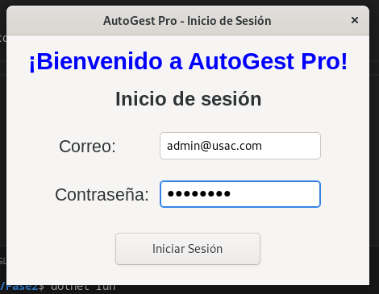
    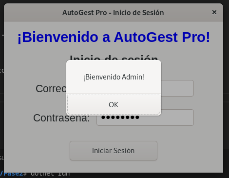

2. Al iniciar sesión con el admin nos redirigira al menú de Admin.

    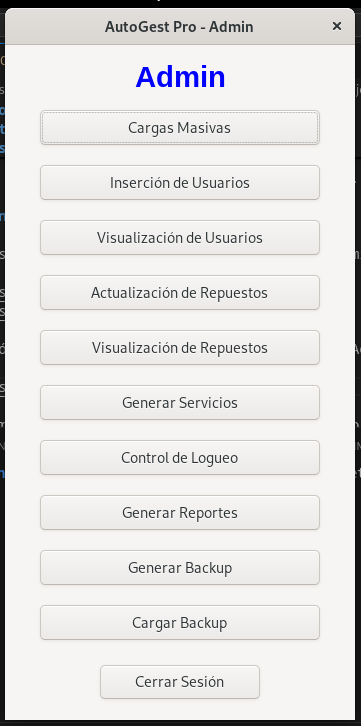

3. Podemos ahora realizar la carga masiva de los usuarios, vehículos, repuestos y en esta fase tambien de servicios.

    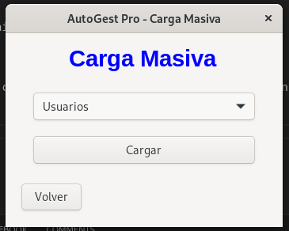
    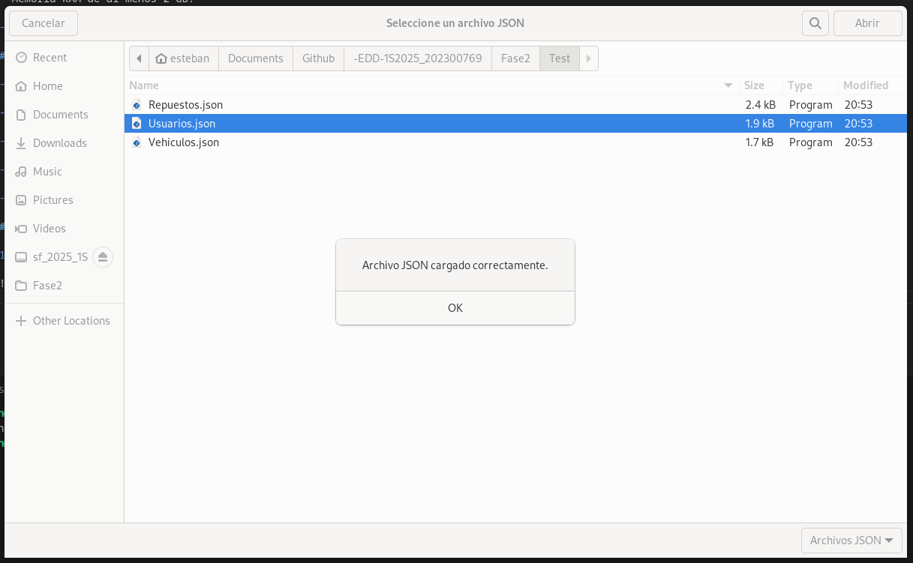
    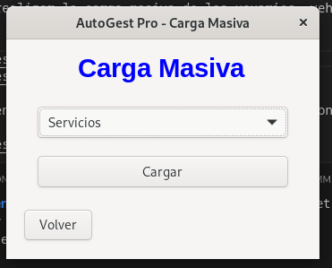
    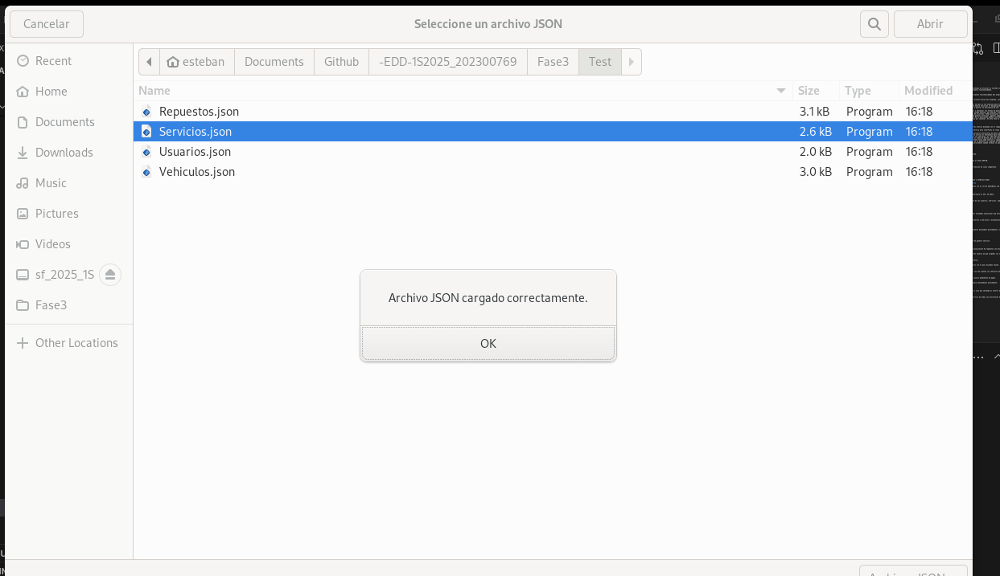

4. Otra manera de insertar usuarios es en la opción de inserción de usuario.

    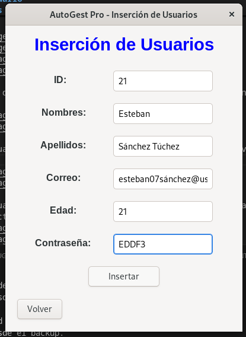
    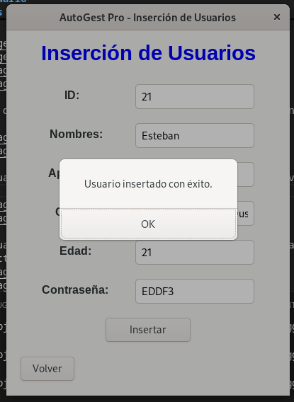

5. Podemos visualizar los datos de los usuarios en la parte de visualización de usuarios.

    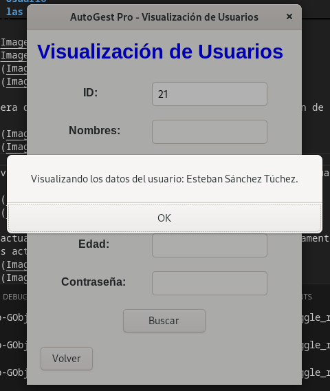
    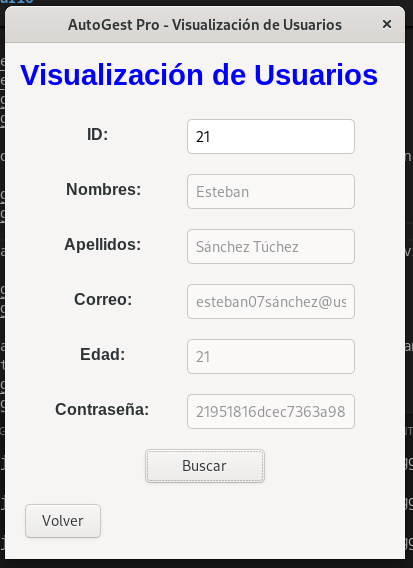

6. Podemos actualizar los datos de un repuesto buscandolo previamente y luego actualizando los campos que queramos actualizar

    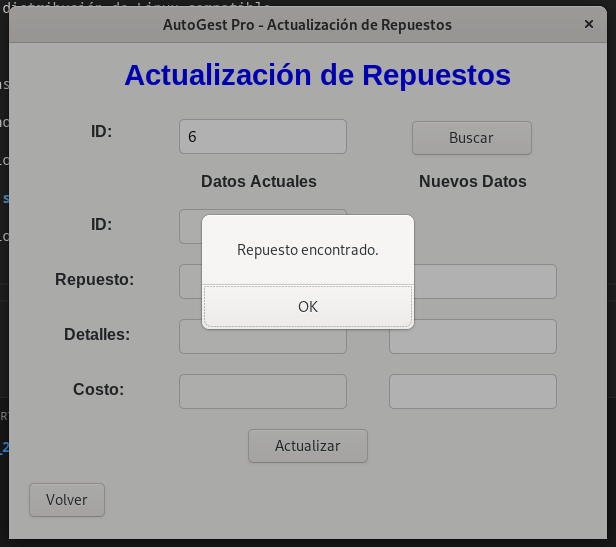
    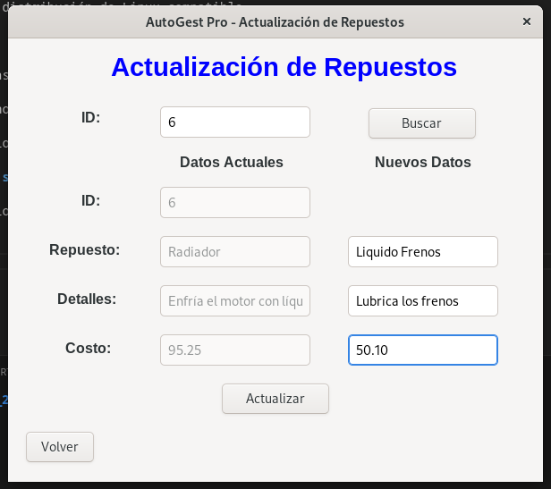
    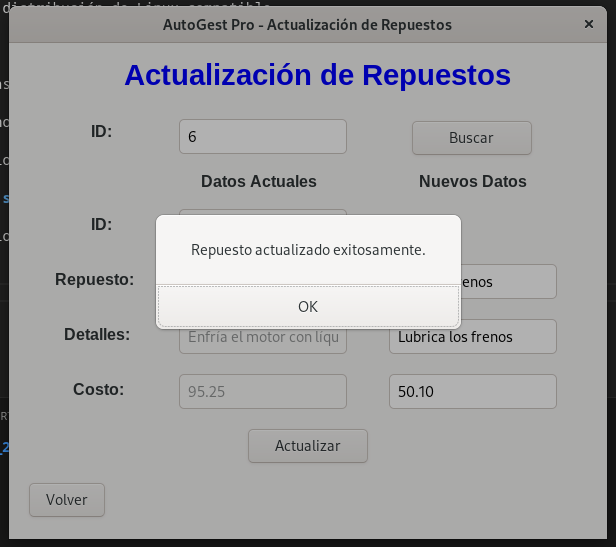
    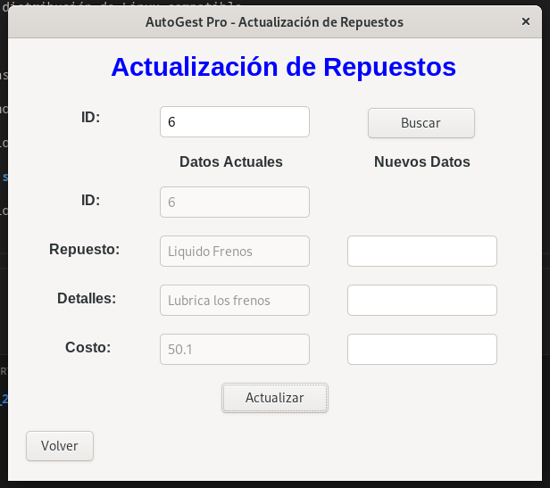

7. Podemos generar servicios en la parte de generar servicio

    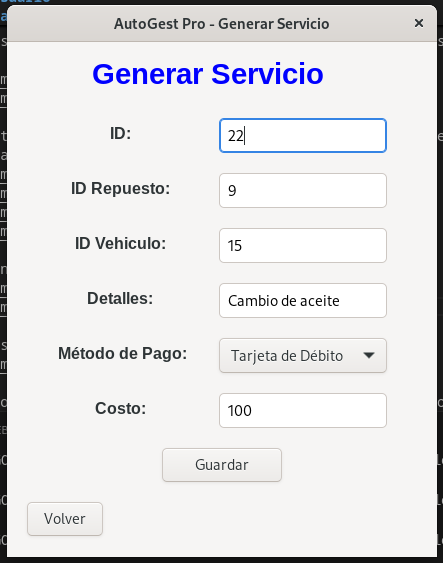
    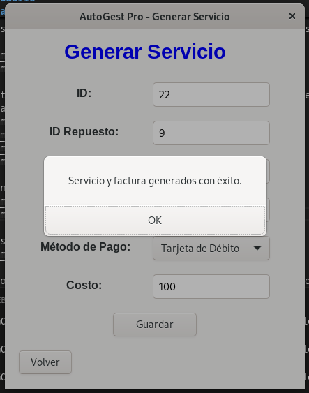

8. Podemos visualizar los repuestos en visualización de repuestos con distintos tipos de recorrido

    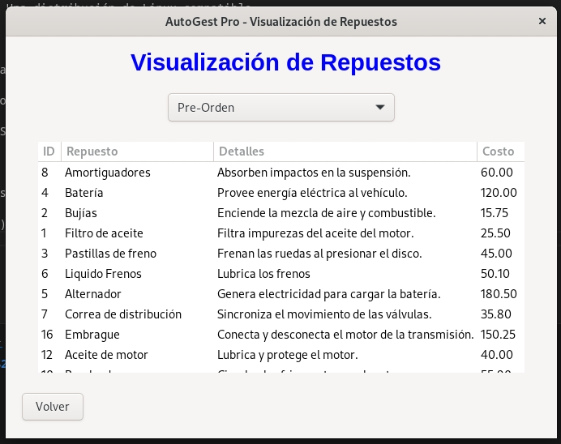

9. Ahora ya podemos ingresar a la parte del usuario ya que cargamos los usuarios en la carga masiva o en inserción de usuarios

    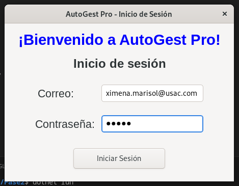
    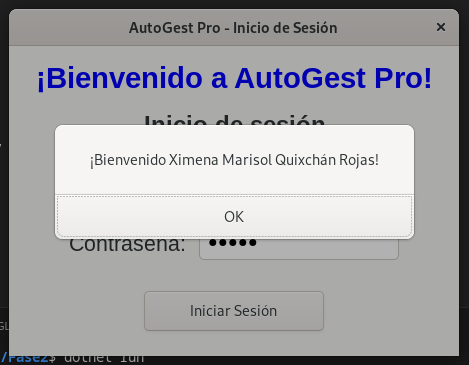

10.  Se redireccionara a la ventana de usuario.

    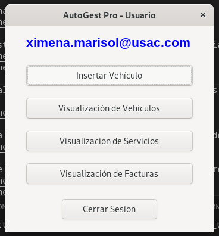

11. Podemos registrar vehiculos del usuario con el que iniciamos sesión.
    
    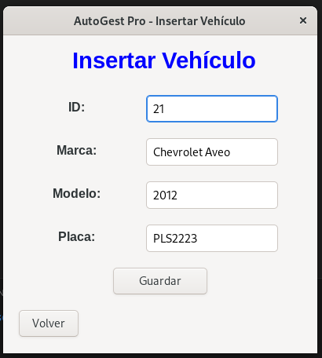
    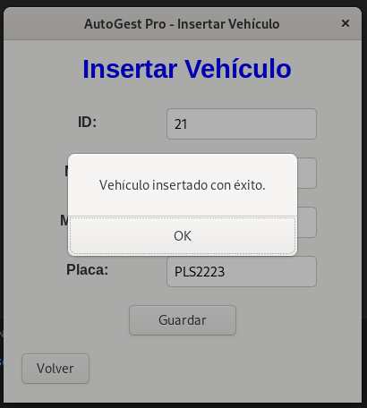

12. Podemos visualizar los vehículos con los que cuenta el usuario.

    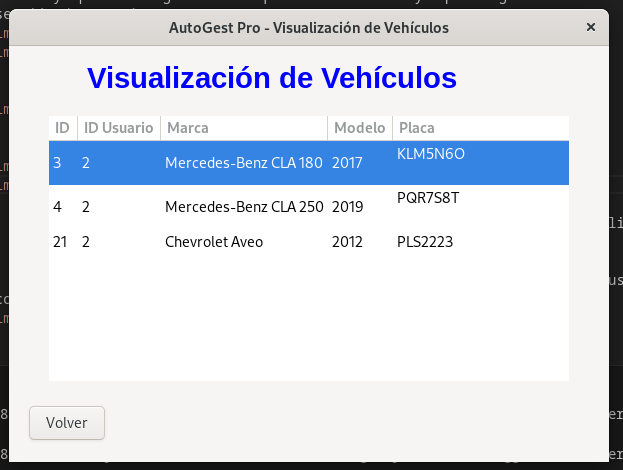

13. Podemos visualizar los servicios con los que cuentan los vehiculos del usuario en distintos tipos de recorridos.

    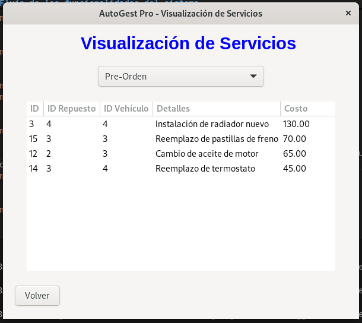

14. Podemos visualizar las facturas del usuario pendientes de pagar.

    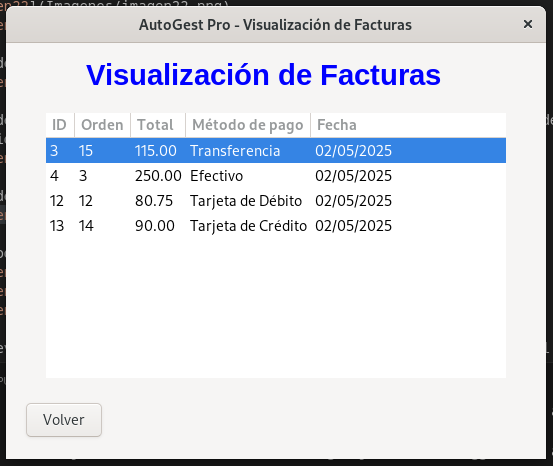

15. Devuelta en el admin podemos generar un json que contenga el control de los inicios de sesión.

    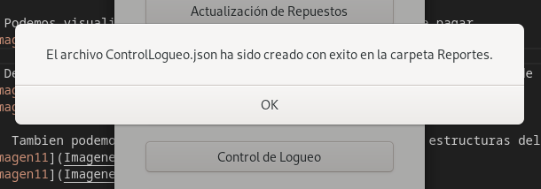
    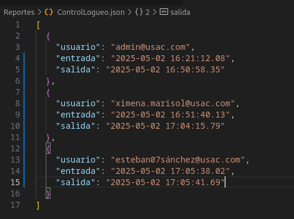

16. Podemos generar un reporte gráfico de todas las estructuras del programa si contienen datos.

    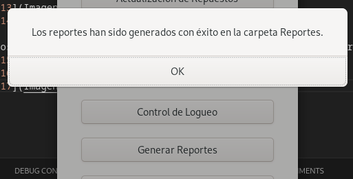
    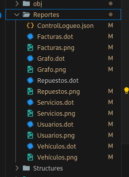
    

17. El administrador puede generar el backup de los datos de las entidades usuario, vehículo y repuesto. El json de los bloques y los archivos comprimidos .edd junto con los json de los arboles para descompresión se guardan en la carpeta backup.

    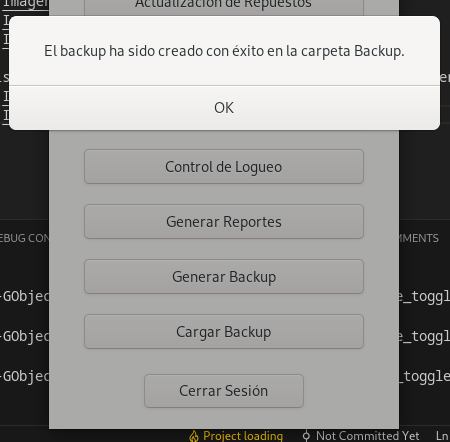
    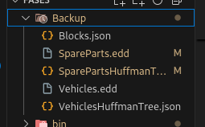

18. Una vez cerrado el programa y vuelto a abrir en el menú de admin se puede cargar el backup de los datos que se tenian con anterioridad y deberian de estar presentes de nuevo.

    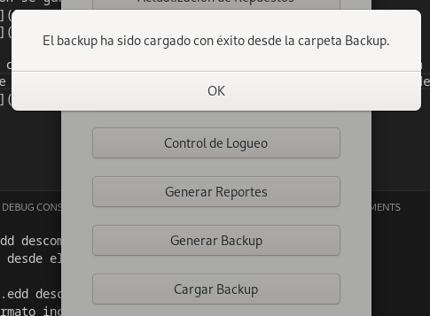